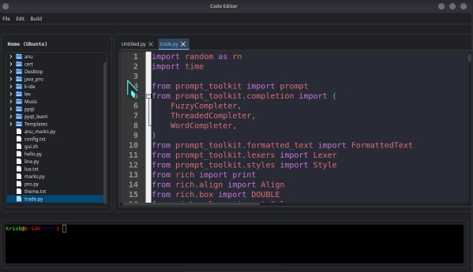

# Krish Integrated Development Environment

  
  

  

  

  

  
  
  
  
  
  

> This simple lightweight code editor made with `PyQt5` and `Qscintilla`

## Editor Features

- One Dark Syntax Highlighting
- Auto Pair
- Auto Indentation
- Auto Suggestion And Completion
- Code Folding

## Additional Features

- Multi-Tab System
- All File Operations (New File, Open File, Save File, Open Folder)
- Editor Operation (Cut, Copy, Paste, Undo, Redo, Select All)
- Tree View
- Run System
- Arrange Code For Python And Html
- Built-in Terminal, Color Picker, Browser (QWebEngine)

## Tech Stack

- `Python` -> easy-syntax language
	- `PyQt5` -> Best GUI Frameword (Desktop-Applications), Qt (`C++`) binding
	- `Qscintilla` -> Package for code editor, all built-in features
	- `QWebEngine` -> Web Browser Package
	- `qtawesome` -> FontAwesome-5 Solid Icons
	- `pyqtdarktheme` -> For Dark Theme
	- `vlc` -> For Music Player system
	- `gi (GTk)` -> Linux Module `C++` GTk binding in python `PyGObject`

## Notes

This Requires Ubuntu Environment
 
This Also Requires Too Many And Heavy Dependencies. Check [Installation Section](#installation-and-setup) To See it

## Upcoming Features

1. Languages Support
	- C#
	- Ruby
	- Rust
	- Markdown
	- JSON
2. Qt And PyQt Project build and run support
3. clone project from git

# Installation And Setup

### Requirements

1. [Termux](https://f-droid.org/en/packages/com.termux/)
2. [RealVNC Viewer: Remote Desktop](https://play.google.com/store/apps/details?id=com.realvnc.viewer.android)

### Initial Setup In Termux

1. Start Termux App
2. Enter Commands Step by Step
	- `yes | pkg up`
	- `pkg install git wget -y`
	- `git clone --depth=1 https://github.com/modded-ubuntu/modded-ubuntu.git`
	- `cd modded-ubuntu`
	- `bash setup.sh`
3. Then Restart your Termux by `exit`
4. enter in ubuntu
	- `ubuntu`
5. setup user
	- `bash user.sh`
6. Then again Restart Termux and enter ubuntu again
7. type this command (This will take many time)
	- `sudo bash gui.sh`
8. note the vnc password that you enter in above process
9. Ubuntu is now successfully installed

### Basic Commands

- Type `ubuntu` in termux to start CLI ubuntu
- Type `vncstart` to start vnc server
- Type `vncstop` to stop vnc server
- Type `bash remove.sh` in termux `modded-ubuntu` folder to remove ubuntu

### Start GUI Ubuntu

1. Start ubuntu and start VNC Server
	- `ubuntu`
	- `vncstart`
2. note the number given in `vncstart` (e.g. :1, :2, :3)
3. start VNC Viewer App (Don't Close the termux)
4. Create new connection if not exists
5. Enter `localhost:<number>` in Address (e.g. `localhost:1`, `localhost:2`)
6. Enter Password (set in `sudo bash gui.sh` process)

### Setup Code Editor

1. clone project
	- `git clone https://github.com/procoder178/k-ide.git`
2. install packages
	- `chmod +x packages.sh`
	- `sudo bash packages.sh`
3. install addition modules
	- `sudo pip3 install -r requirement.txt --break-system-packages`

### Run Code

1. Start VNC Server
2. run code
	- `python3 main.py &`

###	License
This project is licensed under the MIT License.

---
